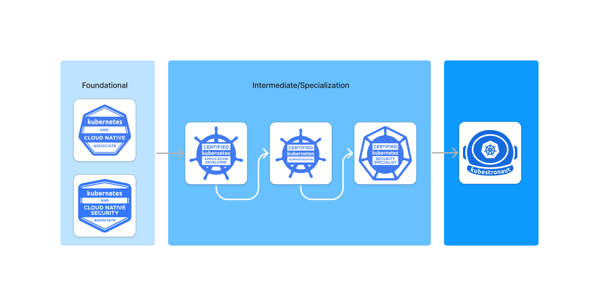

# Kubernetes Certification Notes

The Cloud Native Computing Foundation (CNCF) currently has five Kubernetes-related certification exams: KCNA, KCSA, CKAD, CKA, and CKS. Completing these 5 certifications also makes you a CNCF Kubestronaut, a program which was announced in March 2024 that recognizes community leaders who have consistently invested in their ongoing education and grown their skill level with Kubernetes.  

Foundational certifications are multiple-choice exam while the intermediate ones are performance-based test that consists of a set of performance-based tasks to be solved in a command line.

- [Kubernetes and Cloud Native Associate (KCNA)](https://notes.thecloudspark.com/kcna/)
- [Kubernetes and Cloud Native Security Associate (KCSA)](https://notes.thecloudspark.com/kcsa/)
- [Certified Kubernetes Application Developer (CKAD)](https://notes.thecloudspark.com/kubernetes-certifications/certified-kubernetes-application-developer)
- [Certified Kubernetes Administrator (CKA)](https://notes.thecloudspark.com/kubernetes-certifications/certified-kubernetes-administrator)
- [Certified Kubernetes Security Specialist (CKS)](https://notes.thecloudspark.com/kubernetes-certifications/certified-kubernetes-security-specialist)